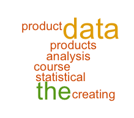
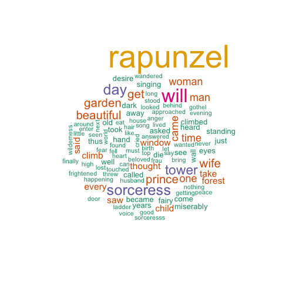
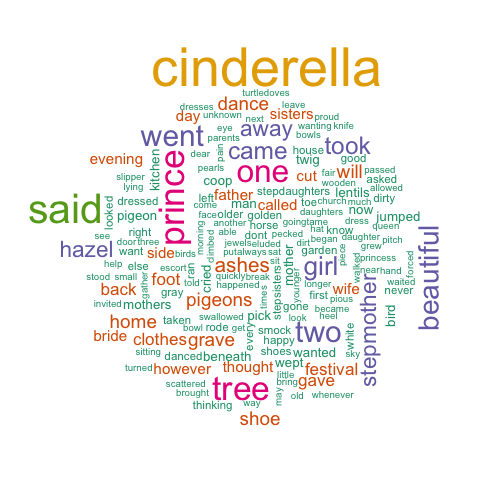

Exploring text
========================================================
### Creating Word Clouds and Evaluating Reading Levels


author: Teresa Nieten





========================================================

## A word cloud provides a visual representation of the words used in text

- More frequently used words are larger
- Color schemes allow for color differentiation
- Summarizes key words in a single view
- Compare the key words from multiple documents

The **Words from Stories** Shiny application provides a list of various web-based stories to evaluate.  The results include a word cloud based on the selected story and the desired maximum number of words, and the Flesch-Kincaid reading grade level of the text.   

Word Clouds
========================================================

### A Tale of two princesses

 

***

 

Reading level
========================================================
**Words from Stories** evaluates the reading level of the selected text using the Flesch-Kincaid grade level scale.  


```r
library(koRpus)
tokens <- tokenize(text, format = "obj", lang = "en")
flesch.kincaid(tokens)
```
### Flesch-Kincaid Grade Level
###  Parameters: default 
###       Grade: 13.43 
###         Age: 18.43 
         
What's next? 
========================================================
We have exciting plans for **Words from Stories**! 

### Upload your own text document
<small>View your paper from a whole new perspective through an interactive word cloud, before you send it to the publisher.
* Discover the terms that are popping out at readers
* Eliminate term overuse</small>

### Provide your own URL
<small>Enter the URL if you have an online document you want to view.</small>

### View results from two documents at once
<small>Can't decide which candidate to choose from?  Run their campaign speeches through **Words from Stories 2.0** and see what they're really saying.</small>
